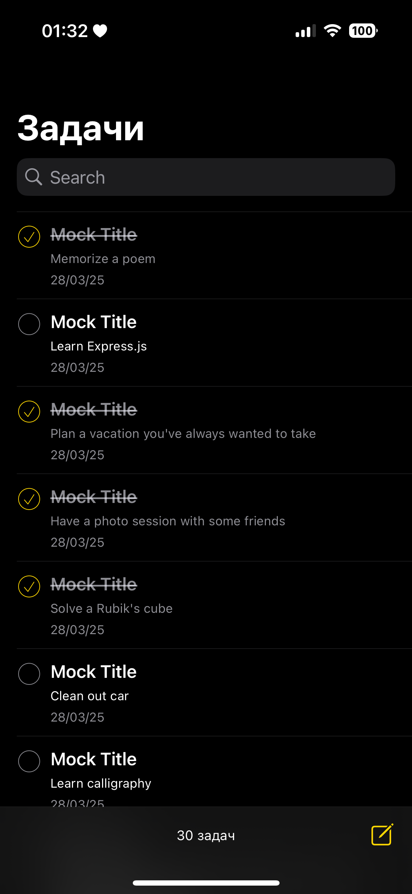
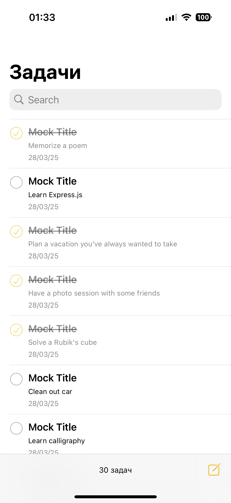
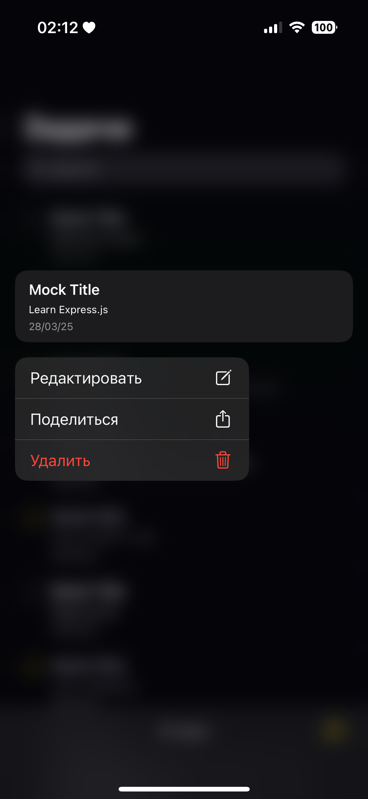

# Effective Mobile TODO app

Тестовое задание для Effective Mobile

## Описание

* При первом запуске прилоения данные загружаются из API и сохраняются в Core Data. При всех последующих запусках данные загружаются из Core Data.
* Приложение поддерживает темную и светлую темы
* Изменения задач сохраняются после выхода из экрана редактирования

## Screenshots
|  |  |
|-------------------------------|-------------------------------|
|  |  |
|                               |
|  |

## Функциональность
- Просмотр списка задач
- Создание, даление, редактирование, просмотр задачи
- Поиск задач

## Stack
* UIKit
* VIPER
* Core Data
* GCD
* URLSession
